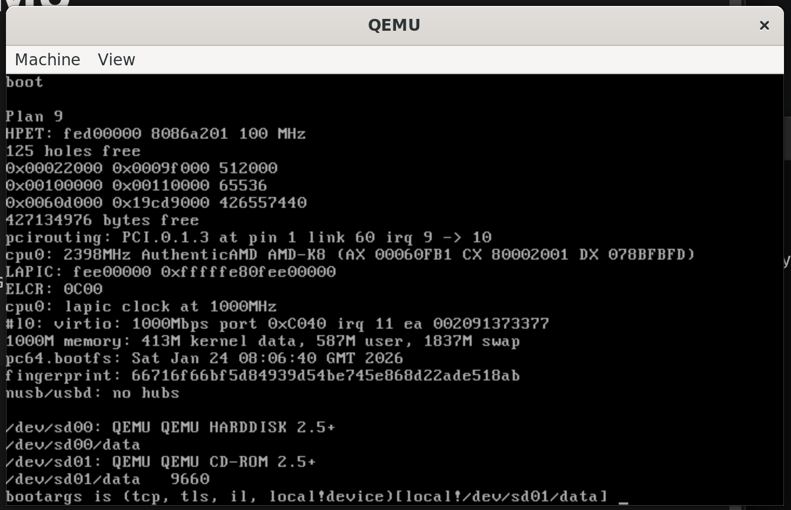

# Install 9front in QEMU

[https://fqa.9front.org/fqa4.html](https://fqa.9front.org/fqa4.html)

[https://fqa.9front.org/fqa3.html#3.3.1](https://fqa.9front.org/fqa3.html#3.3.1)

The below has been tested on Ubuntu running in WSL on Windows 11.

```
cd 9front-notes/qemu/linux
qemu-img create -f qcow2 9front.qcow2.img 30G
./install.sh
```



press enter


press enter


press enter


press enter


press enter


inst/start


press enter


press enter


press enter


sd00


mbr


w enter
q enter


enter


enter


w enter
q enter


enter


enter


enter


enter


enter


enter


enter


enter


enter


enter


enter


enter


enter


enter


enter


Enter your time zone


enter


enter


yes


yes


enter

The system will reboot.
However, the CD is “still in the system”. 🙂
When it gets to this prompt:


you can just close the QEMU window.

The system is installed!

Back on Linux, you can run:

```
./start-qemu.sh
```

to boot 9front.

Press enter at the two prompts.


Have fun!

Use `fshalt` to shutdown 9front.